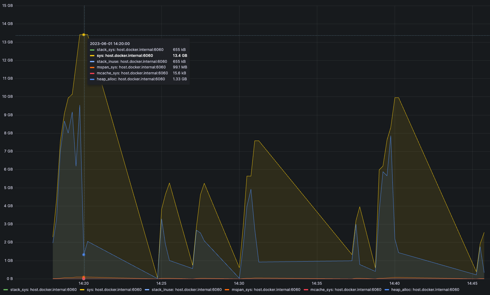

# Optimistic Erigon Mainnet Bedrock Migration - Analysis

Warning: Every calculation assumed every factor is **linearly related**.

## Recon

|   | Goerli | Mainnet |
|---|--------|---------|
| Block Number | $4061223$ | $103529821$ | 
| Account #    | $127608$ | $4071701$ |

Assuming linearity, amplifier for 
- Block Number: $A_{B} = 103529821 / 4061223 \simeq 25.49$
- Account #   : $A_{S} = 4071701 / 127608 \simeq 31.91$ 

## Stat Estimation 

|   | Goerli | Mainnet |
|---|--------|---------|
| Blocks           | $4.6$ GB | $4.6 \times A_{B} \simeq 117.25$ GB  | 
| Receipts         | $3.7$ GB | $3.7 \times A_{B} \simeq 94.31$ GB   |
| Total Difficulty | $15$ MB  | $0.015 \times A_{B} \simeq  0.38$ GB |
| World State Trie | $1.4$ GB | $1.4 \times A_{S} \simeq 44.67$ GB   |
| DB in tar gz     | $7.6$ GB | $7.6 \times \max{(A_{B}, A_{S})} \simeq 242.52$ GB | 
| DB               | $7.7$ GB | $7.7 \times \max{(A_{B}, A_{S})} \simeq 245.71$ GB |
| New DB           | $14$ GB  | $14 \times \max{(A_{B}, A_{S})} \simeq 446.74$ GB |
| New DB in tar gz | $4.6$ GB | $4.6 \times \max{(A_{B}, A_{S})} \simeq 146.79$  GB |

## Storage Estimation 

$446.74$ GB when plain, $146.79$ GB when tarballed.

|   | Goerli | Mainnet |
|---|--------|---------|
| Storage Needed for Migration      | $43.6$ GB | $1338.37$ GB |
| New DB           | $14$ GB  | $446.74$ GB |
| New DB in tar gz | $4.6$ GB | $146.79$ GB |

## Time Estimation

Summation of estimation for [data export](#time-estimation-for-export) and [data import](#time-estimation-for-import).

(Export) $2.20$ h + (Import) $7.69$ h = $9.89$ h

Linearity comes from below observations:

|   | Export Blocks | Export Total Difficulty | Export Receipts |
|---|---------------|-------------------------|-----------------|
| `quad`     | $37$ s  | $31$ s | $100$ s |
| `quad * 2` | $73$ s  | $63$ s | $212$ s |
| `quad * 3` | $112$ s | $96$ s | $350$ s |
| `quad * 4` | $151$ s | $131$ s | $468$ s |

Here, `quad * 4` equals total prebedrock blocks for optimism goerli.

|   | Import Blocks | Import Total Difficulty | Import Receipts | Recover Log Index | Recover Senders | 
|---|---------------|-------------------------|-----------------|-------------------|-----------------|
| `quad`     | $106$ s | $12$ s | $34$ s | $44$ s | $97$ s  |
| `quad * 2` | $226$ s | $23$ s | $66$ s | $98$ s | $191$ s |
| `quad * 3` | $410$ s | $35$ s | $108$ s | $184$ s | $287$ s | 
| `quad * 4` | $570$ s | $46$ s | $147$ s | $265$ s | $326$ s |

Here, `quad * 4` equals total prebedrock blocks for optimism goerli.

|   | Import State |
|---|--------------|
| `quad`     | $82$ s  |
| `quad * 2` | $106$ s |
| `quad * 3` | $185$ s |
| `quad * 4` | $243$ s |

Here, `quad * 4` equals total prebedrock accounts for optimism goerli.

## Time Estimation for Export

|   | Goerli | Mainnet |
|---|--------|---------|
| Export Blocks           | $94$ s   | $94 \times A_{B} \simeq 2396$ s |
| Export Total Difficulty | $82$ s   | $82 \times A_{B} \simeq 2090$ s | 
| Export Receipts         | $310$ s  | $310 \times A_{B} \simeq 7902$ s |
| Export State (jsonl)    | $205$ s  | $205 \times A_{S} \simeq 5225$ s |
| Total Time              | $691$ s  | $\Sigma = 17613$ s $\simeq 4.89$ h |

Parallelizable to reduce to $7902$ s $\simeq 2.20$ h.

## Time Estimation for Import

|   | Goerli | Mainnet |
|---|--------|---------|
| Import Blocks           | $198$ s  | $198 \times A_{B} \simeq 5047$ s |
| Import Total Difficulty | $36$ s   | $36  \times A_{B} \simeq 918$ s |
| Import Receipts         | $100$ s  | $100 \times A_{B} \simeq 2549$ s |
| Import State            | $220$ s  | $220 \times A_{S} \simeq 7021$ s |
| Recover Log Index       | $158$ s  | $158 \times A_{B} \simeq 4028$ s |
| Recover Senders         | $319$ s  | $319 \times A_{B} \simeq 8132$ s |
| Total Time              | $1031$ s | $\Sigma = 27695$ s $\simeq 7.69$ h |

## Memory Estimation

This experiment finds relation between number of accounts and state import memory consumption.

Above screenshot records memory graph from trial 1 to 7.

There are $127608$ accounts for optimism goerli.

| Trial | Start | End | Max Memory |
|-------|-------|-----|------------|
| 1 | `start` | `end` | $13.4$ GB | 
| 2 | `start` | `half` | $5.27$ GB |
| 3 | `start` | `half` | $5.26$ GB |
| 4 | `half` | `end` | $7.58$ GB |
| 5 | `start` | `quad` | $3.97$ GB |
| 6 | `start` | `quad * 3` | $9.95$ GB |
| 7 | `quad * 3` | `end` | $2.56$ GB |
| 8 | `start` | `end` | $14.3$ GB | 
| 9 | `start` | `end` | $12.4$ GB | 
| 10 | `start` | `end` | $12.5$ GB | 

Analyzing results from trial 1, 2, 3, 4: 

$13.4 / ((5.27 + 5.26) / 2 + 7.58) \simeq 1.04$

Analyzing results from trial 1, 6, 7: 

$13.4 / (9.95 + 2.56) \simeq 1.07$

If we assume that memory consumption relation is linear, optimism mainnet memory requirement be $13.4 \times A_{S} $, about $ 427 $ GB
